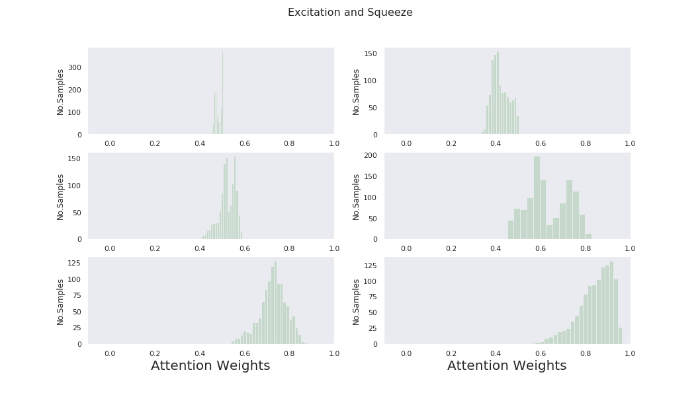

# Brainprint

Brainprint is a Python library based on my PhD research. The library is mainly 
for the classification and interpretation of EEG signals (Motor Imagery Movements). I will share the corresponding paper once it is accepted for publishment. 

## Requirements


```bash
pytorch
pandas
numpy
```
## Documentation

### Main contributions (Novel methods)

1. RCNN-DA: A recurrent convolutional neural network with Double Attention. 
2. Temporal Attention (Squeeze & Excitation): An attention mechanism for emphasizing the slices that contribute the most to the model decision.
3. Spatial attention:  An attention mechanism on the electrodes that contribute the most to the model decision.
4. Guided Grad-Cam for EEG signals: The method is modified to visualise the EEG signals as opposed to images.
5. Augmentatiusing Shuffled-Crossoover crops: Two augmentation techniques for EEG signals.

### Additional methods

1. EEGnet implementation.
2. Convoloutional GRU.
3. EEG-net and Shallow-Net.


### Pre-processing and processing
1. CWT feature extraction.
2. FFT and CSP feature extractors.
3. Windowing functions.
4. Visualisation functions.

### Datasets

1. BCI IV 2a.
2. BCI IV 2b.
3. High gamma.

## Tutorial

```python
The Experiment.ipynb contains a full example of how to used the library e.g. loading the data, augmentation, training and interpretation.
```
### Examples





## Contributing
Pull requests are welcome. For major changes, please open an issue first to discuss what you would like to change.

Please make sure to update tests as appropriate.

## License
[MIT](https://choosealicense.com/licenses/mit/)

<!-- CONTACT -->
## Contact

Ahmed Selim - Ahmed.Selim@live.com